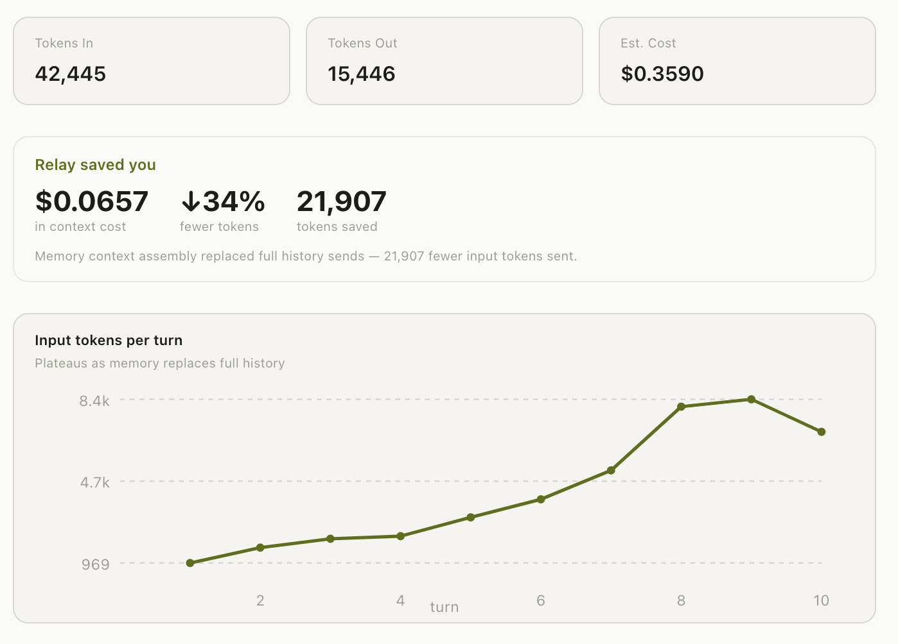

<p align="center">
  
</p>

<p align="center">
  <a href="https://github.com/sanoopsandy/open-relay/blob/main/LICENSE"></a>
  
  
  
  <a href="https://github.com/sanoopsandy/open-relay/stargazers"></a>
</p>

<p align="center">
  <strong>Open-source Mac desktop AI workspace that reduces token cost as your conversations grow longer.</strong><br/>
  Works with Claude, GPT-4o, Gemini, Groq, and Ollama.
</p>

---

## The problem with AI cost at scale

Every AI message you send includes the full conversation history. Turn 10 sends turns 1–9 as context. Turn 20 sends turns 1–19. Token cost compounds linearly — and most of it is redundant context the model doesn't need.

Most AI apps don't solve this. They send everything, every time.

**Relay sends only what matters.**

---

## How Relay keeps tokens flat

Instead of growing the context window unboundedly, Relay assembles a precise, optimised context on every message using three layers:

```
┌─────────────────────────────────────────────────────┐
│  System prompt + personality                        │
├─────────────────────────────────────────────────────┤
│  Smart context block (auto-assembled)               │
│    • Session summary — rolling compression          │  ← replaces old turns
│    • Retrieved memory — semantically relevant facts │  ← replaces re-explaining
│    • Related past sessions — cross-conv retrieval   │  ← from the knowledge graph
├─────────────────────────────────────────────────────┤
│  Last 4 turns verbatim (recency)                   │  ← recent context only
├─────────────────────────────────────────────────────┤
│  Current message                                    │
└─────────────────────────────────────────────────────┘
```

**What this means in practice:**

- Old turns get **compressed into a rolling summary** — not dropped, not repeated verbatim
- Facts you've established get stored in **persistent memory** and retrieved when relevant — so you never re-explain your context
- The knowledge graph surfaces **semantically related content from past conversations** — without you having to find or paste it

The result: token usage plateaus instead of growing with every turn.

---

## Token usage in practice

<p align="center">
  
</p>

This is a real session — 10 turns, 42,445 tokens in, $0.36 total. Without Relay sending full history each turn, the same conversation would have cost ~$0.54. **Relay saved 21,907 tokens (34%)** purely through context assembly — no manual effort.

**The plateau is the signal.** Without Relay, the input token line grows steeply with every turn. With Relay's context assembly, it levels off as memory and summarisation replace raw history.

Savings compound on longer conversations:

| Conversation length | Estimated saving |
|--------------------|-----------------|
| 10 turns | ~30–35% |
| 20 turns | ~50–60% |
| 40+ turns | ~70–80% |

*Measured on Claude Sonnet. Savings vary by model and conversation density.*

---

## Persistent memory: context that carries across sessions

Token savings within a session are only half the story. Relay also eliminates the cost of re-establishing context at the start of every new conversation.

**How it works:**

1. Every assistant response is embedded and indexed into a local vector store
2. Key facts are automatically extracted and saved to a themed memory layer
3. On each new message, Relay searches memory (BM25 + vector similarity + knowledge graph) and injects only what's relevant — not everything

```
/add-to-memory sprint-42 Sprint ends Friday. Auth service is the critical path.
                          Blocked on prod cert renewal (expires June 8).
```

Next session, next week — ask about sprint-42 and Relay already has the context. You don't re-paste it. Those tokens are never sent again.

**Memory is organised by themes you define:**
`sprint-42` · `architecture` · `competitors` · `product` · `team`

---

## Auto-memory: learns from every conversation

You don't have to save everything manually. Relay watches your conversations and promotes important turns into persistent memory automatically:

- Every turn is embedded after streaming completes
- Turns from substantive conversations (6+ turns) are promoted to memory after LLM extraction
- Extraction strips preamble and keeps only facts, numbers, decisions, and structured data
- Frequency-weighted retrieval: topics you return to often rank higher automatically
- 90-day TTL on auto-captured items; manual memory never expires

The memory layer gets denser and more accurate the longer you use Relay — without any manual curation.

---

## GraphRAG: memory that spans conversations

Beyond simple keyword retrieval, Relay builds a **knowledge graph** of your ideas and their connections:

- Entities extracted from each turn become nodes in a [Kuzu](https://kuzudb.com) graph
- Related turns from past conversations surface via 1-hop graph traversal
- Semantic vector search finds relevant content even when wording differs

When you ask about something discussed two weeks ago, Relay finds it — even if you never explicitly saved it.

**Retrieval scoring combines three signals:**

```
score = semantic_similarity × 0.35
      + recency_decay × 0.35
      + frequency_boost × 0.30
```

Frequently-retrieved content scores higher over time. The system learns what matters to you.

---

## Getting started

### Requirements

- **macOS** — Apple Silicon (M1/M2/M3) or Intel
- **Node.js 20+**
- API key for at least one provider — or run **Ollama** locally for free

### Install & run

```bash
git clone https://github.com/sanoopsandy/open-relay.git
cd open-relay
npm install
npm run rebuild   # fixes native binaries (better-sqlite3, Kuzu) for your architecture
npm run dev
```

The onboarding wizard runs on first launch. Your API key is encrypted immediately via macOS Keychain (`safeStorage`) — never stored in plaintext.

### Build a distributable

```bash
npm run build     # produces a .dmg installer in dist/
```

---

## Features

### AI Chat
- Streaming responses from **Claude**, **GPT-4o**, **Gemini**, **Groq**, and **Ollama**
- Switch provider and model live from Settings without restarting
- Attach images, PDFs, and code files — sent as native content blocks
- Conversations auto-titled after the first exchange

### Memory & Context
- Auto-memory: key facts extracted from every conversation automatically
- Manual save: `/add-to-memory <theme> <content>`
- Memory pane — browse, edit, and delete by theme
- GraphRAG retrieval: vector search + Kuzu knowledge graph + session summarisation

### Usage & Savings Tracking
- Per-conversation token and cost breakdown
- **Savings card** — shows exact $ saved and % reduction from context assembly
- **Plateau chart** — visualises tokens-per-turn flattening as memory kicks in
- Input bar token meter — live estimate before sending

### Slash Commands

| Command | Action |
|---------|--------|
| `/add-to-memory <theme> <note>` | Save to memory |
| `/memory` | Toggle memory pane |
| `/new` | New conversation |
| `/clear` | Clear current conversation |
| `/logs` | Structured log viewer |
| `/help` | List all commands |

### Artifacts
- Code, HTML, JSON, CSV, and scripts surface as named downloadable artifacts
- Syntax highlighting for 150+ languages
- Persist across restarts

### Workflow Automation
- Cron-based schedulers that run AI skills against your tools
- **Sprint Analysis Skill**: reads Slack, cross-references memory, flags team members
- Connect Slack, Jira, and GitHub in Settings → Connectors

---

## Architecture

```
Renderer (React 18 + Zustand)
    ↕  window.relay (contextBridge — typed allowlist)
Preload
    ↕  ipcMain.handle / webContents.send
Main process (Node.js)
    ├── AgentRunner         streaming chat, sliding window, context assembly
    ├── ContextAssembler    GraphRAG: vector search + Kuzu graph + session summary
    ├── EmbeddingStore      SQLite BLOB vectors, cosine similarity, frequency tracking
    ├── KuzuGraph           knowledge graph (Turn, MemoryItem, Entity nodes + edges)
    ├── PromotionService    auto-promotes high-value turns to persistent memory
    ├── SessionSummarizer   rolling compression of old turns every 4 messages
    ├── MemoryRepo          SQLite FTS5 + BM25 + recency decay
    ├── ProviderFactory     Claude / OpenAI / Groq / Gemini / Ollama
    ├── SchedulerService    cron jobs + SlackReader + skill execution
    └── ConfigManager       encrypted config via safeStorage
```

**Tech stack:** Electron · React 18 · TypeScript · Vite · Tailwind CSS · Zustand · better-sqlite3 · Kuzu · pino · Anthropic SDK · OpenAI SDK · node-cron · @slack/web-api

---

## Roadmap

| Status | Item |
|--------|------|
| ✅ | Streaming chat, multi-provider, slash commands |
| ✅ | Memory pane, FTS5 + GraphRAG retrieval, artifacts |
| ✅ | Auto-memory: conversation indexing + key fact extraction |
| ✅ | Frequency-weighted retrieval + knowledge graph |
| ✅ | Usage tracking: savings card, plateau chart, per-conversation breakdown |
| ✅ | Sprint Analysis Skill + Slack scheduler |
| 🔨 | Jira context pull (issues + sprint data → memory auto-sync) |
| 🔨 | GitHub PR and issue context |
| 🔨 | Skill builder — save any conversation as a reusable automation |
| 🔨 | Windows / Linux builds |
| 💡 | Memory export / import (JSON, Markdown) |
| 💡 | Multi-agent: skills that spawn sub-conversations |

---

## Contributing

```bash
npm run typecheck   # zero errors required before opening a PR
npm run lint        # ESLint across src/
```

**Good first issues:**
- Additional provider integrations (xAI Grok, Mistral)
- Memory export / import
- Conversation full-text search
- Jira issue fetch (connector is wired, read logic is next)
- Windows / Linux Electron builds
- Test coverage (Vitest — none written yet)

Open an issue before starting significant work so we can align on approach.

---

## Privacy

- All data — conversations, memory, artifacts, graph — stays on your machine in `~/.relay/`
- API keys encrypted at rest via macOS Keychain (`safeStorage`)
- No telemetry, no analytics, no cloud sync — by design
- Relay only talks to the AI provider you explicitly configure

---

## License

MIT — see [LICENSE](LICENSE)

---

<p align="center">
  Built by <a href="https://github.com/sanoopsandy">Sanoop</a> &nbsp;·&nbsp;
  If Relay saves you money, a ⭐ helps more people find it.
</p>
