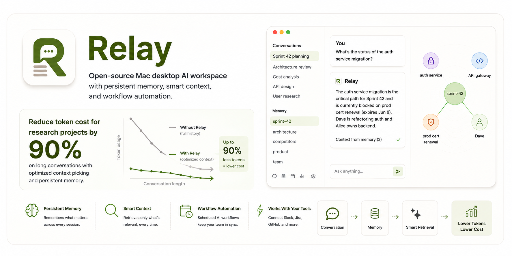

<p align="center">
  
</p>

<p align="center">
  <a href="https://github.com/sanoopsandy/relay/blob/main/LICENSE"></a>
  
  
  
  <a href="https://github.com/sanoopsandy/relay/stargazers"></a>
</p>

<p align="center">
  <strong>Open-source Mac desktop AI workspace with persistent memory, smart context, and workflow automation.</strong><br/>
  Works with Claude, GPT-4o, Gemini, Groq, and Ollama.
</p>

---

## The problem

Every AI session starts from zero. Your product context, sprint state, architecture decisions, research notes — none of it carries over. You paste the same background into every conversation, every day.

Relay fixes this. It builds a persistent memory layer from your conversations, retrieves only what's relevant on each message, and gets smarter the longer you use it. Connect it to Slack and Jira and it keeps your team context fresh automatically.

---

## How it works

```
Every message you send
  ↓
Relay searches memory (BM25 + vector similarity + knowledge graph)
  ↓
Injects only the relevant context — not full history
  ↓
AI already knows your sprint state, your decisions, your constraints
```

**Token impact — measured on a real conversation:**

| Turn | With Relay | Without Relay | Saved |
|------|-----------|---------------|-------|
| 1–2  | 1,222 / 1,458 | same | — |
| 3    | 5,322 | 5,360 | 38 |
| 4    | 5,471 | 6,187 | 716 |
| **5** | **2,414** | **5,878** | **3,464** |
| **6** | **1,890** | **6,078** | **4,188** |
| **Total** | **17,777** | **26,183** | **8,406 (32%)** |

*Savings compound with conversation length. A 20-turn ideation session saves an estimated $1.60+ on Opus pricing.*

---

## Features

### Persistent Memory
- Conversations are automatically indexed and key facts extracted into memory
- Manual save: `/add-to-memory <theme> <content>`
- Organised by themes you define: `sprint-42`, `architecture`, `competitors`, `team`
- BM25 full-text search + recency decay — relevant items surface automatically
- Browse and manage in the **Memory Pane** (timeline view, add/delete inline)

### Smart Context (GraphRAG)
- Every turn embedded into a local vector store (SQLite — no external DB)
- Entities extracted and linked in a [Kuzu](https://kuzudb.com) knowledge graph
- At each message: vector search + 1-hop graph expansion + session summary injected as context
- Past conversations surface when relevant — even if you never explicitly saved them
- Frequency-weighted retrieval: topics you return to often rank higher automatically

### Multi-Provider AI
- **Claude** (Opus, Sonnet, Haiku), **GPT-4o**, **Gemini**, **Groq**, **Ollama** (local, free)
- Switch provider and model live from Settings without restarting
- Attach images, PDFs, and code files — sent as native content blocks

### Workflow Automation
- Cron-based schedulers that run AI skills against your tools
- **Sprint Analysis Skill**: reads Slack, cross-references your sprint plan from memory, flags each team member green / yellow / red
- Missed runs are caught on startup — no missed daily reports if your laptop was closed
- Full run history in the Schedulers panel

### Tool Integrations
| Tool | What Relay does |
|------|----------------|
| **Slack** | Read channel messages, list members, optionally post summaries |
| **Jira** | API token configured (issue fetch coming soon) |
| **GitHub** | Personal access token configured (PR/issue context coming soon) |

### Artifacts
- Code, HTML, JSON, CSV, and scripts the AI generates surface as named downloadable artifacts
- Syntax highlighting for 150+ languages (highlight.js)
- Persist across restarts and link back to the originating conversation

### Slash Commands

| Command | Action |
|---------|--------|
| `/add-to-memory <theme> <note>` | Save to memory |
| `/memory` | Toggle memory pane |
| `/new` | New conversation |
| `/clear` | Clear current conversation |
| `/logs` | Open structured log viewer |
| `/help` | List all commands |

---

## Getting Started

### Requirements

- **macOS** — Apple Silicon (M1/M2/M3) or Intel
- **Node.js 20+**
- API key for at least one provider — or run **Ollama** locally for free

### Install & run

```bash
git clone https://github.com/sanoopsandy/relay.git
cd relay
npm install
npm run rebuild   # fixes native binaries (better-sqlite3, Kuzu) for your architecture
npm run dev
```

The onboarding wizard runs on first launch. Your API key is encrypted immediately via macOS Keychain (`safeStorage`) — never stored in plaintext.

### Build a distributable

```bash
npm run build     # produces a .dmg installer in dist/
```

---

## Example: daily sprint check-in

**1. Save your sprint plan once**
```
/add-to-memory sprint-42
Goal: Ship v2 payments by end of quarter.
Team: Alice + Bob → infra, Carol → Stripe migration, Dave → auth refactor, Eve → API gateway
Critical path: auth → API gateway → payment gateway
Risk: prod cert expires June 8
```

**2. Connect Slack** — Settings → Connectors → Slack (needs `channels:history`, `users:read`)

**3. Create a scheduler** — Settings → Schedulers → New → `0 9 * * 1-5`

**What runs at 9am every weekday:**
```
🟢 Alice — Infrastructure cost reduction PR merged. Moving to RDS instance review.
🟡 Dave  — No update in the last 24h. Auth refactor was blocked yesterday.
🔴 Carol — Explicitly blocked: "waiting on Stripe sandbox credentials from finance"
⚠️  Eve  — Rate limiting task not started. Sprint ends in 3 days.
```

No standup notes to maintain. No spreadsheet to update.

---

## Architecture

```
Renderer (React 18 + Zustand)
    ↕  window.relay (contextBridge — typed allowlist)
Preload
    ↕  ipcMain.handle / webContents.send
Main process (Node.js)
    ├── AgentRunner         streaming chat, sliding window, context assembly
    ├── ContextAssembler    GraphRAG: vector search + Kuzu graph + session summary
    ├── EmbeddingStore      SQLite BLOB vectors, cosine similarity, frequency tracking
    ├── KuzuGraph           knowledge graph (Turn, MemoryItem, Entity nodes + edges)
    ├── PromotionService    auto-promotes high-value turns to persistent memory
    ├── SessionSummarizer   rolling compression of old turns every 4 messages
    ├── MemoryRepo          SQLite FTS5 + BM25 + recency decay
    ├── ProviderFactory     Claude / OpenAI / Groq / Gemini / Ollama
    ├── SchedulerService    cron jobs + SlackReader + skill execution
    └── ConfigManager       encrypted config via safeStorage
```

**Context sent on every message:**
```
[system prompt + personality]
[<context> session summary + retrieved memory + past session turns </context>]
[last 4 turns verbatim]
[current user message]
```

**Tech stack:** Electron · React 18 · TypeScript · Vite · Tailwind CSS · Zustand · better-sqlite3 · Kuzu · pino · Anthropic SDK · OpenAI SDK · node-cron · @slack/web-api

---

## Use cases

| Who | How they use Relay |
|-----|-------------------|
| **Product managers** | Sprint plans, decisions, competitor notes persist across every session |
| **Engineers** | Architecture decisions, ADRs, and known constraints surface automatically |
| **Researchers** | Ideas from past conversations resurface when a related topic comes up |
| **Writers** | Style guide and audience stay in memory — every draft starts from the same baseline |
| **Teams** | Daily scheduler reads Slack and surfaces blockers before standup |

---

## Roadmap

| Status | Item |
|--------|------|
| ✅ | Streaming chat, multi-provider, slash commands |
| ✅ | Memory pane, FTS5 + GraphRAG retrieval, artifacts |
| ✅ | Sprint Analysis Skill + Slack scheduler |
| ✅ | Auto-memory: conversation indexing, key fact extraction, frequency-weighted retrieval |
| ✅ | Usage tracking: token savings, plateau chart, per-conversation breakdown |
| 🔨 | Jira context pull (issues + sprint data → memory auto-sync) |
| 🔨 | GitHub PR and issue context |
| 🔨 | Skill builder — save any conversation as a reusable automation |
| 🔨 | Windows / Linux builds |
| 💡 | Memory export / import (JSON, Markdown) |
| 💡 | Multi-agent: skills that spawn sub-conversations |

---

## Contributing

```bash
npm run typecheck   # zero errors required before opening a PR
npm run lint        # ESLint across src/
```

**Good first issues:**
- Additional provider integrations (xAI Grok, Mistral)
- Memory export / import
- Conversation full-text search
- Jira issue fetch (connector is wired, read logic is next)
- Windows / Linux Electron builds
- Test coverage (Vitest — none written yet)

Open an issue before starting significant work so we can align on approach.

---

## Privacy

- All data — conversations, memory, artifacts, graph — stays on your machine in `~/.relay/`
- API keys encrypted at rest via macOS Keychain (`safeStorage`)
- No telemetry, no analytics, no cloud sync — by design
- Relay only talks to the AI provider you explicitly configure

---

## License

MIT — see [LICENSE](LICENSE)

---

<p align="center">
  Built by <a href="https://github.com/sanoopsandy">Sanoop</a> &nbsp;·&nbsp;
  If Relay saves you time or money, a ⭐ helps more people find it.
</p>
